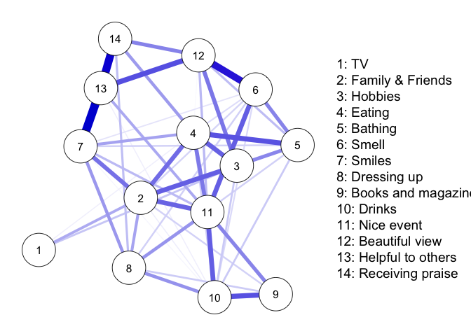
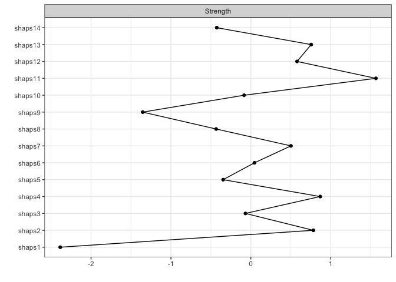

## 使用パッケージ


```r
library(bootnet)
library(qgraph)
```

## データの読み込み

杣取・国里(2019)のデータの一部（SHAPS尺度の項目レベルデータ）を読み込みます。SHPASは，Snaith et al.(1995)が作成したアンヘドニアを測定する尺度であり，本データはその日本語版(Nagayama et al., 2012)への回答データである。


```r
data_shaps <- read.csv("../data/data.csv")
head(data_shaps)
```

```
##   shaps1 shaps2 shaps3 shaps4 shaps5 shaps6 shaps7 shaps8 shaps9 shaps10
## 1      2      2      2      2      2      2      2      3      3       2
## 2      2      1      1      1      2      2      1      2      1       1
## 3      2      2      2      2      2      2      2      2      2       2
## 4      2      2      2      2      1      1      2      2      2       2
## 5      3      2      3      1      3      2      2      3      3       3
## 6      1      1      1      1      1      1      1      2      2       1
##   shaps11 shaps12 shaps13 shaps14
## 1       2       2       2       2
## 2       1       1       1       1
## 3       2       2       2       2
## 4       2       1       2       2
## 5       2       3       2       2
## 6       1       1       1       1
```

## 心理ネットワーク分析
### SHAPSの心理ネットワークの推定

Gaussian Graphical Model(GGM)を用いてSHAPSの心理ネットワークモデルを推定した。その際に，LASSO(least absolute shrinkage and selection operator)の一種のGraphical LASSOを用いている。GLASSOはネットワークのエッジの推定において，影響力が弱い変数の影響をゼロに近づけるようにすることで不要なエッジを除くことができる。GLASSOのパラメータ調整ではEBICを使う。


```r
results_shaps <-  estimateNetwork(data_shaps,default = "EBICglasso")
```

```
## Estimating Network. Using package::function:
##   - qgraph::EBICglasso for EBIC model selection
##     - using glasso::glasso
```

推定したSHAPSの心理ネットワークをプロットする。


```r
plot(results_shaps, 
     layout = "spring",
     labels = TRUE,
     nodeNames = c("TV",
                   "Family & Friends",
                   "Hobbies",
                   "Eating",
                   "Bathing",
                   "Smell",
                   "Smiles",
                   "Dressing up",
                   "Books and magazines",
                   "Drinks",
                   "Nice event",
                   "Beautiful view",
                   "Helpful to others",
                   "Receiving praise"))
```

<!-- -->


### 中心性の指標

推定したSHAPSの心理ネットワークをもとに中心性の指標(Strength)をプロットする。極端に項目１の影響が弱いことが示されている。


```r
centralityPlot(results_shaps)
```

```
## Note: z-scores are shown on x-axis rather than raw centrality indices.
```

<!-- -->

## 引用文献

- Nagayama, H., Kubo, S.-I., Hatano, T., Hamada, S., Maeda, T., Hasegawa, T., Kadowaki, T., Terashi, H., Yoshioka, M., Nomoto, N., Kano, O., Inoue, M., Shimura, H., Takahashi, T., Uchiyama, T., Watanabe, H., Kaneko, S., Takahashi, T., Baba, Y., & Young Japanese Expert Group for Parkinson’s Disease and Movement Disorders: YJ-EXPANDS. (2012). Validity and reliability assessment of a Japanese version of the Snaith-Hamilton pleasure scale. Internal Medicine , 51(8), 865–869.
- Snaith, R. P., Hamilton, M., Morley, S., Humayan, A., Hargreaves, D., & Trigwell, P. (1995). A Scale for the Assessment of Hedonic Tone the Snaith–Hamilton Pleasure Scale. The British Journal of Psychiatry: The Journal of Mental Science, 167(1), 99–103.
- 杣取恵太・国里愛彦 (2019). アンヘドニア(anhedonia)と遅延割引：Lempert & Pizzagalli(2010)の追試　心理学評論, 62(3), 231-243. 
